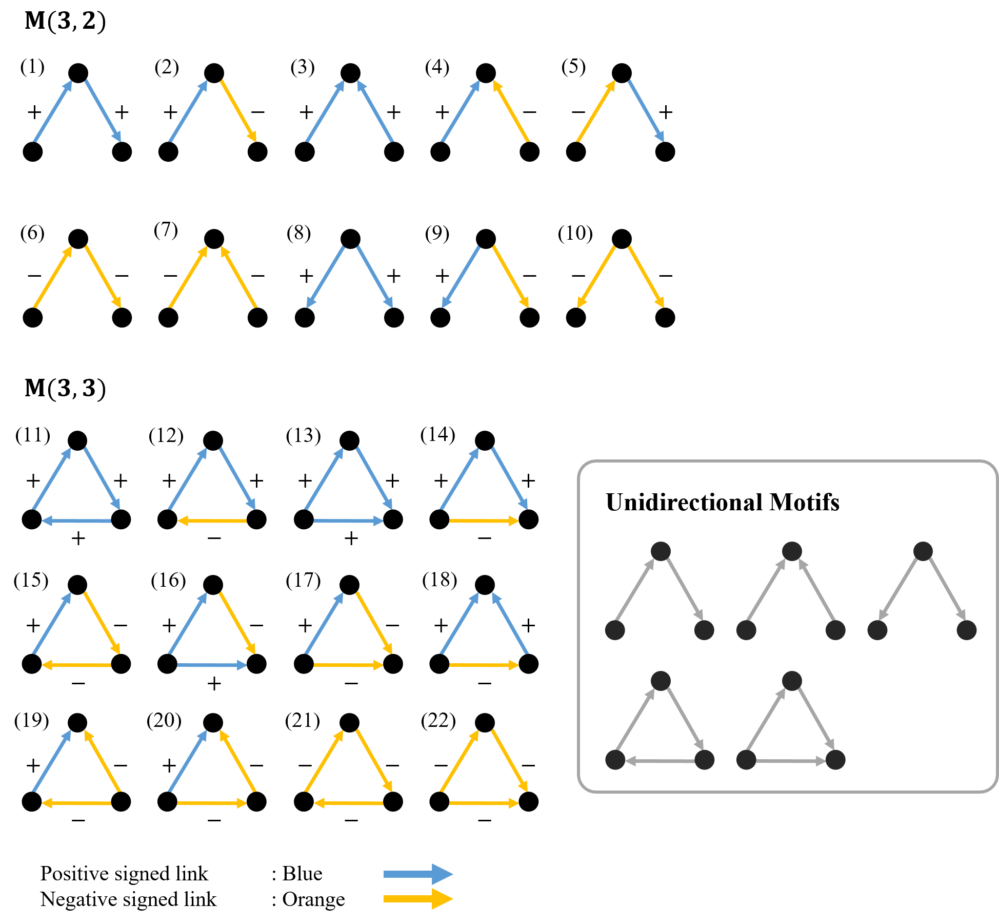

# Code detecting Motifs with signed uni-directed links

  A motif is a pattern which observed higher/lower than expected in random networks with conserved the degree properties.
Detecting the motif is meaningful in that we understand the structural advantage of a target network.
However, detection is a challenge because there are many possible motifs.
To simplify this issue, we consider the motifs that consist of 3 nodes with uni-directional signed weighted links.
We calculate the z-score to compare the frequencies of motifs in networks consisting of different nodes and links.
The z-score indicates the number of standard deviations from the mean a data point is.
By measuring the z-scores of motifs, we can explore the correlations among the scores and network properties.

  

  Three-node motifs should have two or three links to connect all nodes. 
There are five types of motifs considering only the direction of each link because we regard the mirror and rotational symmetry. 
However, we can obtain 22 types of motifs by considering both the direction and sign. 
The roles can vary depending on their sign of links, even if the structures may be the same when only considered the direction of links.

